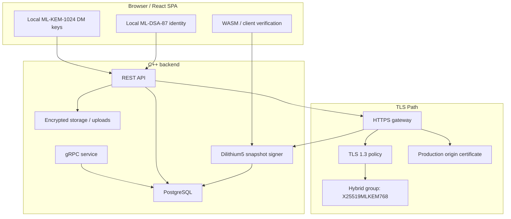
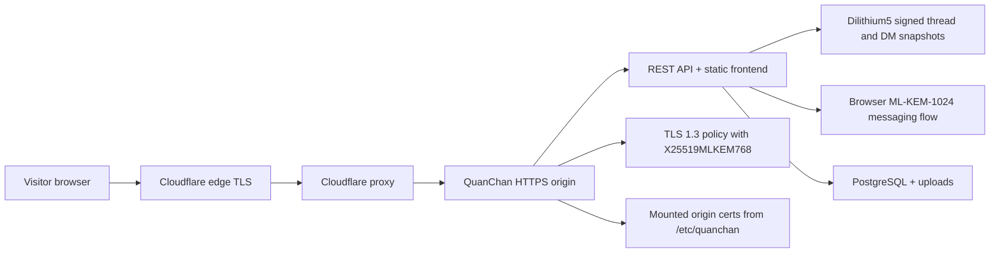

<div align="center">

# QuanChan

### Post-Quantum Anonymous Communication Platform

[](https://doi.org/10.5281/zenodo.19423061)
[](https://www.gnu.org/licenses/agpl-3.0)
[](https://quanchan.online)

[](https://isocpp.org/)
[](https://www.typescriptlang.org/)
[](https://react.dev/)
[](https://vitejs.dev/)
[](https://www.postgresql.org/)
[](https://www.docker.com/)
[](https://www.openssl.org/)
[](https://grpc.io/)

---

*A full-stack, post-quantum anonymous imageboard and messaging platform with browser-resident cryptographic identity, end-to-end encrypted direct messaging, and runtime transport disclosure.*

[Live Platform](https://quanchan.online) · [Research Paper](https://doi.org/10.5281/zenodo.19423061) · [ResearchGate](https://www.researchgate.net/publication/403513949_QuanChan_Extending_a_Quantum-Safe_Backend_into_a_Full-Stack_Post-Quantum_Anonymous_Communication_Platform)

</div>

---

## What It Does

QuanChan is not just an imageboard with PQC buzzwords added on top. The project pushes post-quantum mechanisms into the parts of the application that actually matter to end users:

1. **Browser-generated ML-DSA-87 rooted identity** — no centralized username/password databases
2. **Browser-side ML-KEM-1024 + AES-256-GCM direct messages** — message secrecy independent of server trust
3. **Dilithium5-signed thread and DM snapshots** — verifiable content integrity via frontend WASM
4. **Runtime transport disclosure** through `/crypto`, `/api/crypto/status`, and `/api/crypto/tls-proof`
5. **Identity-bound moderation** — moderator and founder workflows tied to cryptographic identity state

## Features

| Area | What it does |
| --- | --- |
| 🏛️ Anonymous boards | Board, thread, and reply posting with archive support |
| 🔏 Signed content | Dilithium5-signed thread payloads and DM snapshots |
| 🔐 PQC direct messages | Browser-side `ML-KEM-1024 + AES-256-GCM` encrypted messaging |
| 🪪 Identity | Local ML-DSA-87 rooted identity with display-hash profiles and 12-word seed recovery |
| 👥 Social layer | Friend requests, message requests, notifications, moderation reports |
| 🖼️ Media | Uploads, image attachments, and encrypted DM image payloads |
| 🔍 Runtime transparency | `/crypto`, `/api/crypto/status`, and `/api/crypto/tls-proof` |
| 🪙 Crypto payments | Strictly validated NOWPayments IPN webhook integration supporting BTC, LTC, and XMR |
| 💎 Dynamic tags | Character-length dynamically priced user badges with layout overflow cautionary alerts |
| 👥 Group rooms | Circle Tier private cryptographic rooms with group key rotation and signature checks |
| 🤖 Zero-knowledge AI | Hermes Tier ML-KEM-1024 hybrid encrypted AI completions (`/api/hermes/v1/chat/completions`) |
| 🚀 Production deploy | Docker Compose deployment with fixed mounted origin certificates |

## Architecture

QuanChan splits responsibility across the browser, the backend, and the transport layer instead of pretending TLS alone solves the whole problem:

1. The browser generates a local ML-DSA-87 identity and ML-KEM-1024 direct-message key material.
2. The backend exposes HTTPS and gRPC services backed by PostgreSQL.
3. Thread payloads and direct-message snapshots are signed server-side with Dilithium5 and verified client-side.
4. Runtime transport status is disclosed through `/crypto`, `/api/crypto/status`, and `/api/crypto/tls-proof`.
5. In Cloudflare-backed production, edge TLS and origin TLS are treated as separate layers, so PQC transport claims come from observed runtime state rather than static config alone.

### System Architecture



### Cloudflare Production Flow



## Security Model

- **Browser-generated identity** instead of password-first accounts
- **Browser-side `ML-KEM-1024 + AES-256-GCM`** direct-message encryption
- **Dilithium5-signed** thread responses and direct-message snapshots
- **Runtime handshake disclosure** through the `X-PQC-Cipher` header and `/api/crypto/tls-proof`
- **Founder and moderator actions** tied to identity state and recorded in moderation logs
- **Fixed origin certificate deployment** with runtime disclosure rather than overstated transport claims

## Stack

| Layer | Technology |
| --- | --- |
| Frontend | React + Vite + TypeScript |
| Backend | C++ HTTPS and gRPC server |
| Database | PostgreSQL 16 |
| Crypto | OpenSSL 3.5, liboqs, Dilithium5, ML-DSA-87, ML-KEM-1024, AES-256-GCM |
| Runtime | Docker Compose |
| Production | Cloudflare (edge TLS) + Oracle Cloud (origin) |

## Research & Publications

QuanChan continues the earlier Quantum Safe Backend work as the implemented full-stack follow-up.

| Paper | Title |
| --- | --- |
| **Part I** | *Quantum Safe Backend: Design and Implementation of a Post-Quantum Cryptographic Secure Storage and Communication Platform* |
| **Part II** | *QuanChan: Extending a Quantum-Safe Backend into a Full-Stack Post-Quantum Anonymous Communication Platform* |

#### Mirrors & Archives

| Platform | Link |
| --- | --- |
| 📄 Zenodo (DOI) | [](https://doi.org/10.5281/zenodo.19423061) |
| 📚 ResearchGate | [QuanChan on ResearchGate](https://www.researchgate.net/publication/403513949_QuanChan_Extending_a_Quantum-Safe_Backend_into_a_Full-Stack_Post-Quantum_Anonymous_Communication_Platform) |
| 🔗 Part I Codebase | [Quantum-Safe-Backend](https://github.com/Sujithb128989/Quantum-Safe-Backend) |
| 🌐 Live Platform | [quanchan.online](https://quanchan.online) |

#### Citation

```bibtex
@article{sujith2026quanchan,
  title     = {QuanChan: Extending a Quantum-Safe Backend into a Full-Stack
               Post-Quantum Anonymous Communication Platform},
  author    = {B, Sujith},
  year      = {2026},
  doi       = {10.5281/zenodo.19423061},
  url       = {https://doi.org/10.5281/zenodo.19423061},
  publisher = {Zenodo}
}
```

## Quick Start

Use Docker for the full stack. In this mode the backend serves the frontend over HTTPS on port `8080`.

```powershell
docker compose up -d --build
docker compose ps
```

Open:

- App: `https://localhost:8080/`
- Health: `https://localhost:8080/health`

Default ports:

| Port | Service |
| --- | --- |
| `8080` | HTTPS app and REST API |
| `50051` | gRPC server |
| `5432` | PostgreSQL (local dev only) |
| `5173` | Vite dev server (frontend-only mode) |

> **Note:** For production, do not expose PostgreSQL publicly unless you intentionally need remote database access.

## Production Deployment

For production, keep certificates and the real environment file outside the repository. The deploy script reads them from `/etc/quanchan` by default.

Key production fields:

- `HTTPS_PORT`: host port to expose HTTPS on, usually `443`
- `GRPC_PORT`: gRPC port if you expose it externally

Production certificate layout:

```
/etc/quanchan/
├── server.crt    # origin certificate presented by the container
├── server.key    # matching private key
├── ca.crt        # issuer or trust anchor used by the runtime
└── .env          # server-only production environment file
```

Set this up once on the server:

```bash
sudo mkdir -p /etc/quanchan
sudo chown root:<deploy-user> /etc/quanchan
sudo chmod 750 /etc/quanchan
```

Recommended `.env` contents:

```env
PG_PASSWORD=change_this_to_a_long_random_password
HTTPS_PORT=443
GRPC_PORT=50051
```

Recommended permissions:

```bash
sudo chown root:<deploy-user> /etc/quanchan/.env /etc/quanchan/server.crt /etc/quanchan/server.key /etc/quanchan/ca.crt
sudo chmod 640 /etc/quanchan/.env /etc/quanchan/server.key
sudo chmod 644 /etc/quanchan/server.crt /etc/quanchan/ca.crt
```

Cloudflare-backed production setup:

- `server.crt`: Cloudflare Origin Certificate
- `server.key`: the matching private key generated when the origin certificate was created
- `ca.crt`: Cloudflare Origin RSA root CA when using an RSA origin certificate
- Cloudflare SSL/TLS mode: `Full (strict)`
- origin TLS groups configured as `X25519MLKEM768:X25519`

Recommended production update flow:

```sh
git pull origin main && bash scripts/deploy-prod.sh
```

Then verify:

```sh
curl -k https://localhost/health
curl -k https://localhost/api/crypto/tls-proof
```

## Frontend Dev Mode

Use this if you want hot reload while developing the frontend separately.

```powershell
cd frontend
npm install
npm run dev
```

| Script | What it does |
| --- | --- |
| `npm run dev` | Local Vite dev server |
| `npm run dev:lan` | Expose Vite on your LAN |
| `npm run dev:tunnel` | Tunnel-based dev flow |
| `npm run build` | Production build |
| `npm run preview` | Preview built frontend |
| `npm run preview:lan` | Preview built frontend on LAN |

## Database Schema

<details>
<summary>View full table and index listing</summary>

**Tables:**

- `messages`
- `boards`
- `threads`
- `posts`
- `profiles`
- `interactions`
- `friend_requests`
- `direct_messages`
- `message_requests`
- `blocks`
- `notifications`
- `reports`
- `bans`
- `moderation_events`

**Representative indexes:**

- `idx_threads_board`
- `idx_posts_thread`
- `idx_interactions_post`
- `idx_friends_users`
- `idx_direct_messages_pair`
- `idx_direct_messages_receiver`
- `idx_message_requests_recipient`
- `idx_message_requests_requester`
- `idx_blocks_blocker`
- `idx_notifications_user`
- `idx_reports_target`
- `idx_reports_post`
- `idx_bans_target`
- `idx_moderation_events_created`
- `idx_moderation_events_actor`

</details>

## API Endpoints

<details>
<summary>View full endpoint listing</summary>

| Method | Endpoint | Description |
| --- | --- | --- |
| `GET` | `/health` | Health check |
| `GET` | `/api/boards` | List all boards |
| `GET` | `/api/boards/:id` | Get board by ID |
| `GET` | `/api/threads?board_id=<board>` | List threads for a board |
| `GET` | `/api/threads/:id` | Get thread by ID |
| `POST` | `/api/threads` | Create a thread |
| `POST` | `/api/posts` | Create a post |
| `PATCH` | `/api/threads/:id/archive` | Archive a thread |
| `GET` | `/api/profile/:hash` | Get profile by identity hash |
| `POST` | `/api/profile/update` | Update profile |
| `POST` | `/api/interact` | Record interaction |
| `POST` | `/api/friends/request` | Send friend request |
| `POST` | `/api/friends/accept` | Accept friend request |
| `GET` | `/api/friends/:hash` | Get friends list |
| `POST` | `/api/messages` | Send a direct message |
| `GET` | `/api/messages?user_hash=<hash>&peer_hash=<hash>` | Get DM conversation |
| `GET` | `/api/messages/snapshot?user_hash=<hash>&peer_hash=<hash>` | Get signed DM snapshot |
| `GET` | `/api/messages/inbox/:hash` | Get DM inbox |
| `GET` | `/api/crypto/status` | Crypto algorithm status |
| `GET` | `/api/crypto/tls-proof` | TLS handshake proof |
| `GET` | `/api/stats` | Platform statistics |
| `POST` | `/api/upload` | Upload a file |
| `POST` | `/api/store` | Store encrypted data |
| `GET` | `/api/retrieve?id=<id>` | Retrieve stored data |

</details>

## Testing and Runtime Evidence

The fuller testing write-up lives in [testing.md](./testing.md).

<details>
<summary>View captured evidence</summary>

### Frontend build verification

The frontend production build completed successfully.


### Frontend lint findings

The lint step currently reports existing issues that should be treated as engineering debt rather than hidden from the documentation.


### Docker Compose runtime

The system stack was running with PostgreSQL healthy and the PQC backend exposed on HTTPS and gRPC.


### API integration evidence

Runtime API integration was validated against the live backend stack and documented in the testing write-up.


### Captured crypto status output

The live `/api/crypto/status` output confirms the configured algorithms and the latest observed TLS metadata.


### Captured TLS proof output

The live `/api/crypto/tls-proof` output shows the latest observed TLS handshake data and the current transport classification.


</details>

## Credits and Acknowledgments

- **Research, system design, and implementation:** Sujith
- **Project lineage:** QuanChan builds directly on the earlier [Quantum Safe Backend](https://github.com/Sujithb128989/Quantum-Safe-Backend) paper and repository
- **Core open-source building blocks:** React, Vite, TypeScript, PostgreSQL, gRPC, `cpp-httplib`, OpenSSL 3.5, and `liboqs`
- **Standards foundation:** NIST post-quantum standardization work for ML-KEM and ML-DSA
- **Deployment and interoperability:** Cloudflare PQC and origin-TLS documentation
- **Testing and verification:** Runtime crypto disclosure endpoints, Docker-based deployment, and the evidence captured in [testing.md](./testing.md)

## License

This project is licensed under the GNU Affero General Public License Version 3 (AGPLv3). See [LICENSE](./LICENSE).

---

<div align="center">

**[quanchan.online](https://quanchan.online)**

[](https://doi.org/10.5281/zenodo.19423061)

</div>
