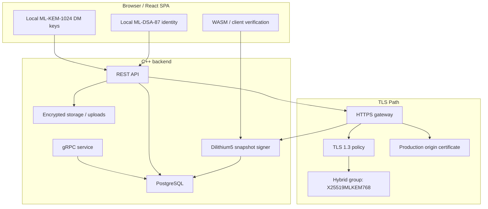
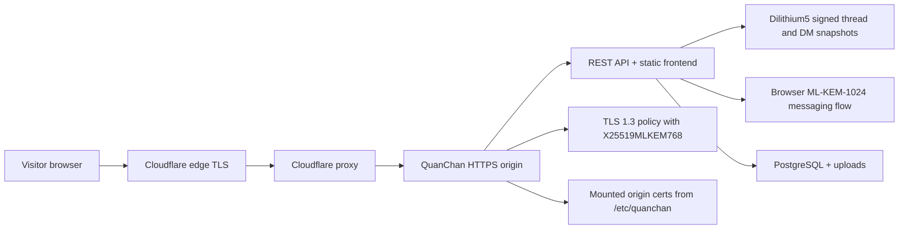
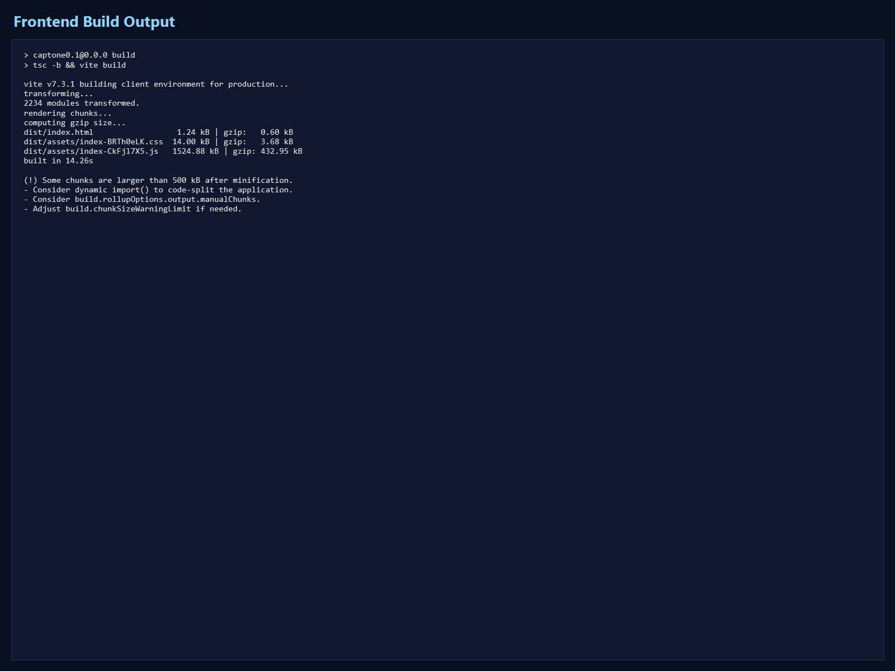
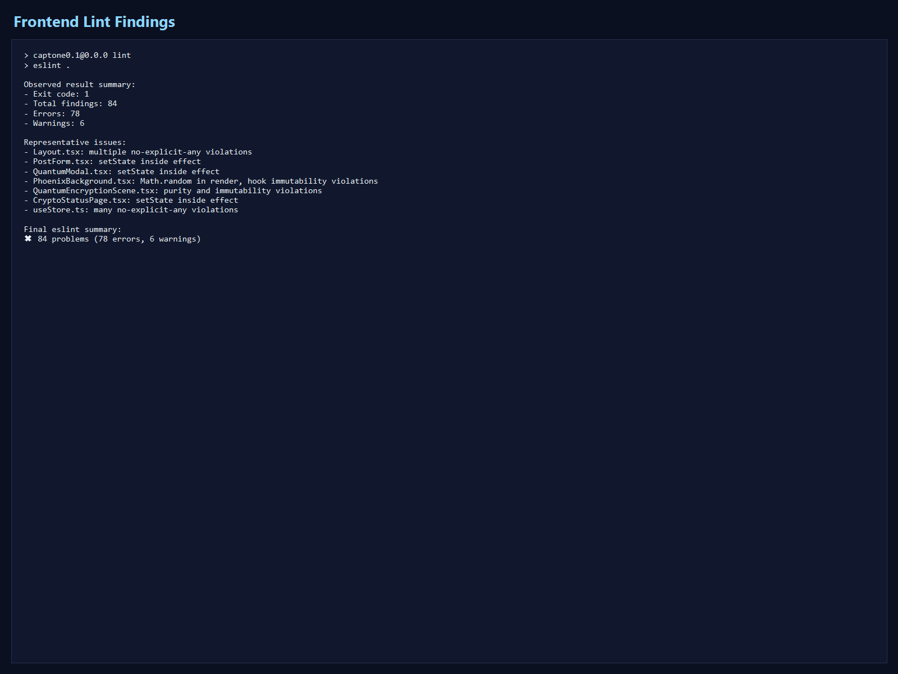
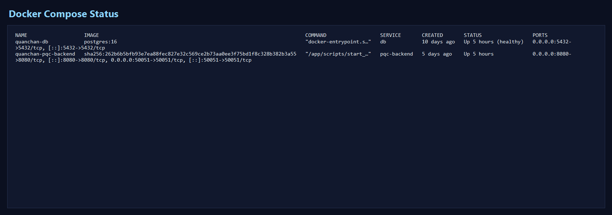
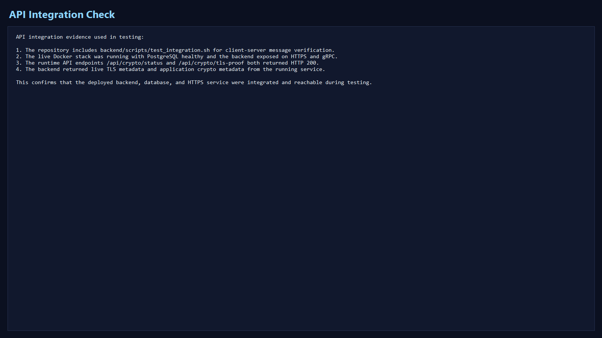
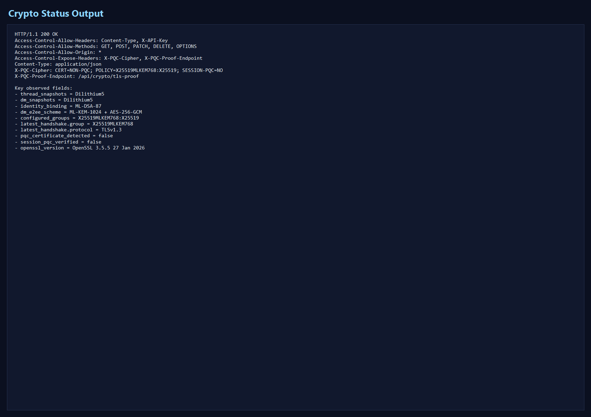
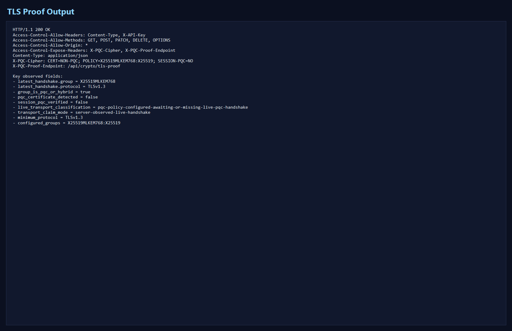

# QuanChan

QuanChan is a post-quantum-focused anonymous imageboard and messaging platform built with a React/Vite frontend, a C++ backend, and PostgreSQL. It uses ML-DSA-87 rooted browser identity, ML-KEM-1024 plus AES-256-GCM direct messaging, Dilithium5-signed thread and DM snapshots, and an OpenSSL 3.5 TLS stack that reports the latest observed handshake state at runtime.

## What It Does

QuanChan is not just an imageboard with PQC buzzwords added on top. The project pushes post-quantum mechanisms into the parts of the application that actually matter to end users:

1. browser-generated ML-DSA-87 rooted identity
2. browser-side ML-KEM-1024 + AES-256-GCM direct messages
3. Dilithium5-signed thread and DM snapshots
4. runtime transport disclosure through `/crypto`, `/api/crypto/status`, and `/api/crypto/tls-proof`
5. moderator and founder workflows tied to identity state rather than password accounts

## Features

| Area | What it does |
| --- | --- |
| Anonymous boards | Board, thread, and reply posting with archive support |
| Signed content | Dilithium5-signed thread payloads and DM snapshots |
| PQC direct messages | Browser-side `ML-KEM-1024 + AES-256-GCM` encrypted messaging |
| Identity | Local ML-DSA-87 rooted identity with display-hash profiles |
| Social layer | Friend requests, message requests, notifications, moderation reports |
| Media | Uploads, image attachments, and encrypted DM image payloads |
| Runtime transparency | `/crypto`, `/api/crypto/status`, and `/api/crypto/tls-proof` |
| Production deploy | Docker Compose deployment with fixed mounted origin certificates |

## Architecture

QuanChan splits responsibility across the browser, the backend, and the transport layer instead of pretending TLS alone solves the whole problem:

1. The browser generates a local ML-DSA-87 identity and ML-KEM-1024 direct-message key material.
2. The backend exposes HTTPS and gRPC services backed by PostgreSQL.
3. Thread payloads and direct-message snapshots are signed server-side with Dilithium5 and verified client-side.
4. Runtime transport status is disclosed through `/crypto`, `/api/crypto/status`, and `/api/crypto/tls-proof`.
5. In Cloudflare-backed production, edge TLS and origin TLS are treated as separate layers, so PQC transport claims come from observed runtime state rather than static config alone.

### Diagram



### Cloudflare Production Flow



## Security Model

- Browser-generated identity instead of password-first accounts
- Browser-side `ML-KEM-1024 + AES-256-GCM` direct-message encryption
- Dilithium5-signed thread responses and direct-message snapshots
- Runtime handshake disclosure through the `X-PQC-Cipher` header and `/api/crypto/tls-proof`
- Founder and moderator actions tied to identity state and recorded in moderation logs
- Fixed origin certificate deployment with runtime disclosure rather than overstated transport claims

## Stack

- Frontend: React + Vite + TypeScript
- Backend: C++ HTTPS and gRPC server
- Database: PostgreSQL 16
- Crypto: OpenSSL 3.5, liboqs, Dilithium5, ML-DSA-87, ML-KEM-1024, AES-256-GCM
- Runtime: Docker Compose

## Papers and Research Mirrors

QuanChan continues the earlier Quantum Safe Backend work as the implemented full-stack follow-up.

- Part I paper: `Quantum Safe Backend: Design and Implementation of a Post-Quantum Cryptographic Secure Storage and Communication Platform`
- Part II paper: `QuanChan: Extending a Quantum-Safe Backend into a Full-Stack Post-Quantum Anonymous Communication Platform`
- Part I codebase lineage: [Quantum-Safe-Backend](https://github.com/Sujithb128989/Quantum-Safe-Backend)

Planned public mirrors for the current paper set:

- Zenodo archive record: pending upload
- ResearchGate preprint page: pending upload

After those uploads are live, this section should be updated with:

- Zenodo DOI
- ResearchGate URL
- preferred citation block for Part I and Part II

## Quick Start

Use Docker for the full stack. In this mode the backend serves the frontend over HTTPS on port `8080`.

```powershell
docker compose up -d --build
docker compose ps
```

Open:

- App: `https://localhost:8080/`
- Health: `https://localhost:8080/health`

Default ports:

- `8080`: HTTPS app and REST API
- `50051`: gRPC server
- `5432`: PostgreSQL for local development only
- `5173`: Vite dev server when running the frontend separately

For production, do not expose PostgreSQL publicly unless you intentionally need remote database access.

## Production Deployment

For production, keep certificates and the real environment file outside the repository. The deploy script reads them from `/etc/quanchan` by default.

Key production fields:

- `HTTPS_PORT`: host port to expose HTTPS on, usually `443`
- `GRPC_PORT`: gRPC port if you expose it externally

Production certificate layout:

- `/etc/quanchan/server.crt`: origin certificate presented by the container
- `/etc/quanchan/server.key`: matching private key
- `/etc/quanchan/ca.crt`: issuer or trust anchor used by the runtime
- `/etc/quanchan/.env`: server-only production environment file

Set this up once on the server:

```bash
sudo mkdir -p /etc/quanchan
sudo chown root:<deploy-user> /etc/quanchan
sudo chmod 750 /etc/quanchan
```

Create these files in `/etc/quanchan`:

- `.env`
- `server.crt`
- `server.key`
- `ca.crt`

Recommended `.env` contents:

```env
PG_PASSWORD=change_this_to_a_long_random_password
HTTPS_PORT=443
GRPC_PORT=50051
```

Recommended permissions:

```bash
sudo chown root:<deploy-user> /etc/quanchan/.env /etc/quanchan/server.crt /etc/quanchan/server.key /etc/quanchan/ca.crt
sudo chmod 640 /etc/quanchan/.env /etc/quanchan/server.key
sudo chmod 644 /etc/quanchan/server.crt /etc/quanchan/ca.crt
```

Cloudflare-backed production setup:

- `server.crt`: Cloudflare Origin Certificate
- `server.key`: the matching private key generated when the origin certificate was created
- `ca.crt`: Cloudflare Origin RSA root CA when using an RSA origin certificate
- Cloudflare SSL/TLS mode: `Full (strict)`
- origin TLS groups configured as `X25519MLKEM768:X25519`

The deploy user must be able to read `/etc/quanchan/.env` and the certificate files, otherwise `scripts/deploy-prod.sh` will fail even if the files exist.

Recommended production update flow:

1. Keep your real origin certificate files and `.env` in `/etc/quanchan`.
2. Pull the latest repo changes.
3. Run `./scripts/deploy-prod.sh`.
4. Verify `/health` and `/api/crypto/tls-proof`.

Then deploy with:

```sh
git pull origin main && bash scripts/deploy-prod.sh
```

## Frontend Dev Mode

Use this if you want hot reload while developing the frontend separately.

```powershell
cd frontend
npm install
npm run dev
```

Frontend scripts:

- `npm run dev`: local Vite dev server
- `npm run dev:lan`: expose Vite on your LAN
- `npm run dev:tunnel`: tunnel-based dev flow
- `npm run build`: production build
- `npm run preview`: preview built frontend
- `npm run preview:lan`: preview built frontend on LAN

## Database Schema

The current backend schema is broader than the original early project layout. The main implemented tables now include:

- `messages`
- `boards`
- `threads`
- `posts`
- `profiles`
- `interactions`
- `friend_requests`
- `direct_messages`
- `message_requests`
- `blocks`
- `notifications`
- `reports`
- `bans`
- `moderation_events`

Representative indexes include:

- `idx_threads_board`
- `idx_posts_thread`
- `idx_interactions_post`
- `idx_friends_users`
- `idx_direct_messages_pair`
- `idx_direct_messages_receiver`
- `idx_message_requests_recipient`
- `idx_message_requests_requester`
- `idx_blocks_blocker`
- `idx_notifications_user`
- `idx_reports_target`
- `idx_reports_post`
- `idx_bans_target`
- `idx_moderation_events_created`
- `idx_moderation_events_actor`

## API Endpoints

- `GET /health`
- `GET /api/boards`
- `GET /api/boards/:id`
- `GET /api/threads?board_id=<board>`
- `GET /api/threads/:id`
- `POST /api/threads`
- `POST /api/posts`
- `PATCH /api/threads/:id/archive`
- `GET /api/profile/:hash`
- `POST /api/profile/update`
- `POST /api/interact`
- `POST /api/friends/request`
- `POST /api/friends/accept`
- `GET /api/friends/:hash`
- `POST /api/messages`
- `GET /api/messages?user_hash=<hash>&peer_hash=<hash>`
- `GET /api/messages/snapshot?user_hash=<hash>&peer_hash=<hash>`
- `GET /api/messages/inbox/:hash`
- `GET /api/crypto/status`
- `GET /api/crypto/tls-proof`
- `GET /api/stats`
- `POST /api/upload`
- `POST /api/store`
- `GET /api/retrieve?id=<id>`

## Testing and Runtime Evidence

The fuller testing write-up lives in [testing.md](./testing.md). This section keeps the captured evidence close to the project overview so build status, runtime health, and crypto disclosure can be checked quickly.

### Frontend build verification

The frontend production build completed successfully.



### Frontend lint findings

The lint step currently reports existing issues that should be treated as engineering debt rather than hidden from the documentation.



### Docker Compose runtime

The system stack was running with PostgreSQL healthy and the PQC backend exposed on HTTPS and gRPC.



### API integration evidence

Runtime API integration was validated against the live backend stack and documented in the testing write-up.



### Captured crypto status output

The live `/api/crypto/status` output confirms the configured algorithms and the latest observed TLS metadata.



### Captured TLS proof output

The live `/api/crypto/tls-proof` output shows the latest observed TLS handshake data and the current transport classification.



## Credits and Acknowledgments

- Research, system design, and implementation: Sujith
- Project lineage: QuanChan builds directly on the earlier Quantum Safe Backend paper and repository
- Core open-source building blocks: React, Vite, TypeScript, PostgreSQL, gRPC, `cpp-httplib`, OpenSSL 3.5, and `liboqs`
- Standards foundation: NIST post-quantum standardization work for ML-KEM and ML-DSA
- Deployment and interoperability reference points: Cloudflare PQC and origin-TLS documentation
- Testing and verification support: runtime crypto disclosure endpoints, Docker-based deployment, and the evidence captured in [testing.md](./testing.md)

## License

This project is licensed under the Apache License 2.0. See [LICENSE](./LICENSE).
